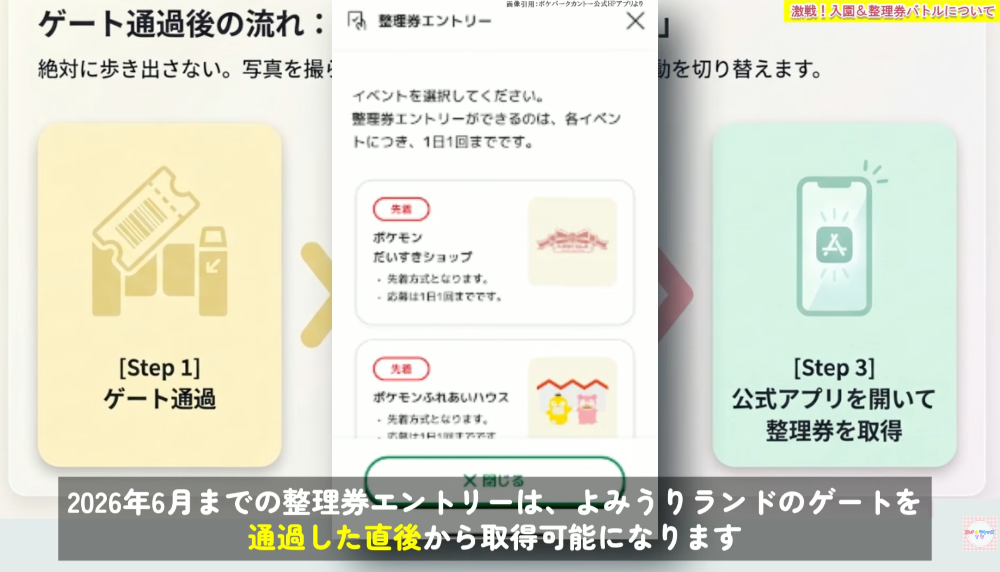
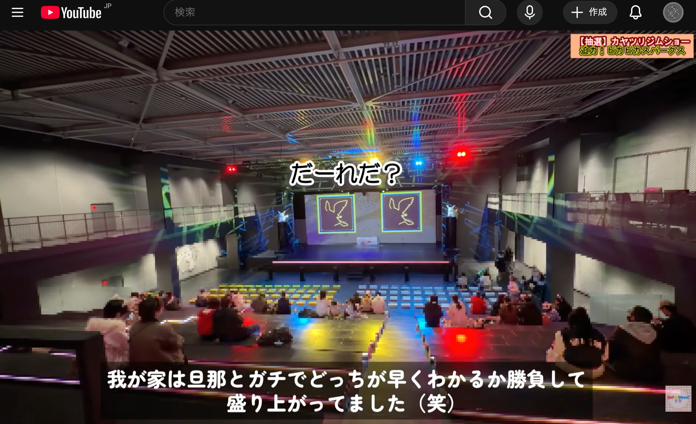
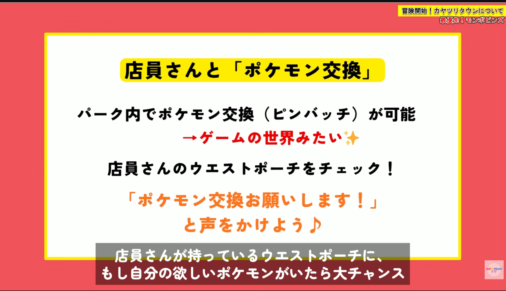
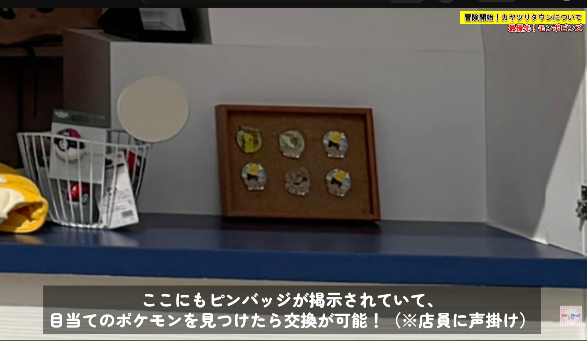
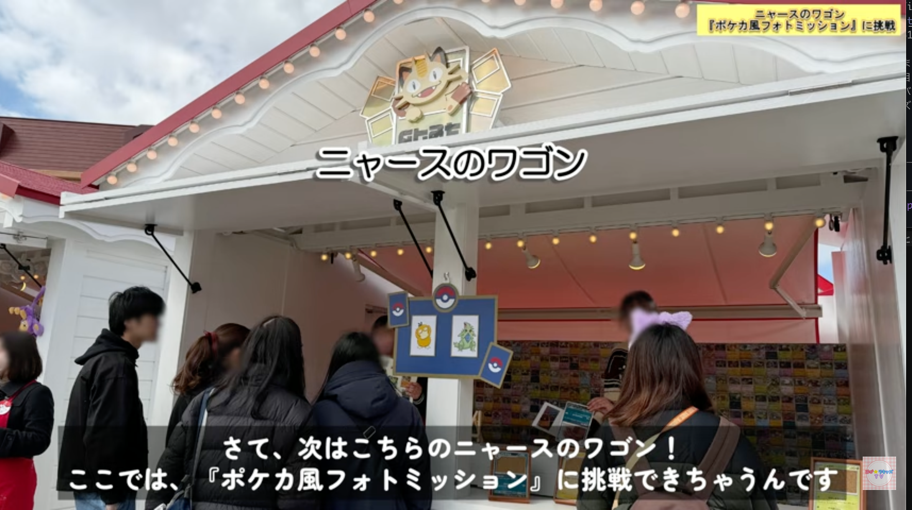
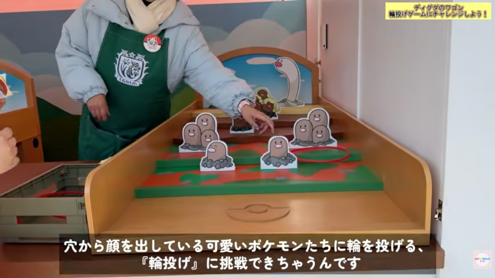

# ポケパーク カントー 家族旅行プラン

4人家族（大人2名・小3男子・小1女子）でポケパーク カントーを満喫するためのプランと準備タスクを管理するリポジトリです。

---

## 基本情報

| 項目 | 内容 |
|------|------|
| **訪問日** | **2026年6月28日（日）** |
| チケット | トレーナーズパス（フォレスト+タウン両エリア対応） |
| フォレスト入場時刻 | **13:00〜**（時間指定枠） |
| 会場 | よみうりランド遊園地内（東京都稲城市） |
| キャッシュレス | **現金一切不可**。カード・スマホ決済のみ |
| よみうりランド開園 | 9:00 |
| ポケパーク開園 | 10:00 |
| パレード「ピカブイバブルカーニバル」| 1日2回：**13:20** / **15:50**（目安） |

---

## アクセス（大倉山駅から）

### ルート1（推奨）07:21発 → 08:14着　53分・IC 573円・乗換2回

| 時刻 | 駅 | 路線 | 備考 |
|------|----|------|------|
| **07:21発** | 大倉山 | 東急東横線 渋谷行 | 2番線発→4番線着。8両編成・前〜中寄り |
| 07:30着 / **07:37発** | 武蔵小杉 | JR南武線 立川行 | 2番線発→2番線着。6両編成・前寄り |
| 07:58着 / **08:01発** | 稲田堤 | 徒歩 | 京王稲田堤まで徒歩約5分 |
| 08:06着 / **08:12発** | 京王稲田堤 | 京王相模原線快速 橋本行 | 1番線発→1番線着 |
| **08:14着** | 京王よみうりランド | — | バス or ゴンドラでよみうりランドへ |

### ルート2（予備）07:28発 → 08:26着　58分・IC 573円・乗換2回

| 時刻 | 駅 | 路線 | 備考 |
|------|----|------|------|
| **07:28発** | 大倉山 | 東急東横線 小手指行 | 2番線発→4番線着。8両編成・前〜中寄り |
| 07:36着 / **07:43発** | 武蔵小杉 | JR南武線 稲城長沼行 | 2番線発→2番線着。6両編成・前寄り |
| 08:04着 / **08:07発** | 稲田堤 | 徒歩 | 京王稲田堤まで徒歩約5分 |
| 08:12着 / **08:24発** | 京王稲田堤 | 京王相模原線快速 橋本行 | 1番線発→1番線着 |
| **08:26着** | 京王よみうりランド | — | バス or ゴンドラでよみうりランドへ |

京王よみうりランド駅からよみうりランドへ：バス（読01系統）約5分 or ゴンドラ「スカイシャトル」往復500円/人（朝は未運行の場合あり → バス推奨）

> **入園ゲートの注意：** よみうりランドのゲート（スカイゲート）には2列ある。**左側がポケパーク カントー専用列、右側が通常列。** 必ず左側に並ぶ。間違えると入園が遅れ、整理券争奪戦で圧倒的に不利になる。


> 赤＝ポケパーク列（左）、青＝よみうりランド列（右）。念のため案内看板をしっかり確認して正しく並ぶこと。

### 入園後 → ポケパーク カントーへの動き方

1. ゲートを通過したら**左手のエスカレーターを降りる**
2. 案内看板が少ないため、わからなければスタッフや他の来場者に確認
3. **徒歩約10分**でポケパーク カントーのエントランスに到着

### エントランス広場の配置

```
        [ カヤツリタウン（正面） ]
左：ポケモンフォレスト     右：ポケモンだいすきショップ
             ↑ エントランス（ここで立ち止まって整理券エントリー）
```

到着したらすぐに動かず、**この場で整理券をエントリーしてから各エリアへ向かう。**

> **ポケパーク入口は激混み（チケットなしでも入れるため）。入口での写真撮影は後回しでOK → スルーしてカヤツリタウンへ直行。**

---

## カヤツリタウン 施設一覧

| 施設 | 種別 | メモ |
|------|------|------|
| ポケモンセンター | 体験 | ぬいぐるみ回復体験。**ショーの時間と被らないよう注意** |
| フレンドリィショップ | 飲食・購入 | ゲームアイテム再現グッズ購入可。裏にポケパーク限定マンホールあり |
| カヤツリジム | アトラクション | **ピカピカスパーク**開催（整理券抽選）。たまに食事スペースとして解放（アプリ通知あり） |
| ピカピカパラダイス | アトラクション | 1,200円/人 |
| ブイブイヴォヤージュ | アトラクション | 1,200円/人 |
| **ポケモンふれあいハウス** | 体験 | **整理券（先着）**。8匹から3匹が登場・うち1体と触れ合い |
| **ポケモントレーナーズマーケット** | ショップ | **モンスターボール入りピンズはここ**。スタッフとの交換も可 |
| デカヌチャンワゴン | ワゴン | 名入れキーホルダー（ピカチュウ・イーブイ各1,800円）。**先に注文→後で受け取りがベスト** |
| ニャースワゴン | ワゴン | ポケカ風フォトフレーム無料配布。日替わりポケモン撮影ミッション→ステッカーもらえる |
| ディグダワゴン | ミニゲーム | 無料。1人1本・何回でもOK。成功/失敗でそれぞれステッカーもらえる |
| インフォメーションワゴン | 案内 | — |
| カヤツリタウン エグジット | 出口 | タウン→だいすきショップへの行き来は**再入場スタンプ**が必要 |

---

## ⏰ 当日タイムライン

> **日曜日のため混雑必至。整理券はよみうりランド入園後（9:00〜）すぐに取得できる。**  
> ふれあいハウスは開園10分足らずで全枠が埋まることがある。GW実績では9:08入園でも15時台しか残っていなかった。  
> **推奨出発：大倉山 07:21 → よみうりランド 08:20〜着、開園前に並ぶ。日曜は特に早着が重要。**

### 〜 午前：整理券確保 & タウン探索 〜

| 時刻 | 行動 | ポイント |
|------|------|---------|
| **07:21** | **大倉山駅 出発** | 東急東横線。IC 573円、乗換2回 |
| **08:20〜** | よみうりランド到着・開園前に並ぶ | **ポケパーク カントー専用列**に並ぶこと |
| **9:00〜9:10** | よみうりランド入園 → **整理券を即エントリー** | 大人2人で分担！この10分が1日の勝負。ゲート通過直後はエントリー開始まで数分かかる場合あり |
| 9:10〜10:00 | よみうりランド内で時間つぶし | クレープ・よみうりランドのアトラクション等 |
| 10:00〜10:30 | カヤツリタウン入場 | **ポケパーク入口は激混み・入口写真は後でもOK → スルーしてタウン直行**。10〜11時は入場列30分待ちの実績あり |
| 10:30〜 | **まずポケモントレーナーズマーケットへ → ピンズ購入** | 入場直後に向かうのがおすすめ |
| 10:30〜12:30 | ランチ購入・ディグダワゴン・ポケモンセンター・ストリートグリーティングなど | 空いている時間に自由に回る |
| （抽選当選時のみ）**11:25〜** | **ピカピカスパーク 入場待ち** | 入場開始30分前以上に並ぶと良席。11:45〜25分間 |
| （落選時）11:25〜 | バースデーシール・ニャースワゴン・ストリートグリーティング | 待ち時間なしで楽しめる無料体験 |
| 12:30〜13:00 | 軽食 + **フォレスト前トイレ** | 昼時は座席不足・立食覚悟。**フォレスト内にトイレなし** |

### 〜 午後：フォレスト & アトラクション 〜

| 時刻 | 行動 | ポイント |
|------|------|---------|
| **13:00〜14:00** | **ポケモンフォレスト 入場受付（1時間）** | **13:45頃の入場が狙い目**（人が少なく快適）。60〜90分コース。エリア内トイレなし・再入場不可 |
| 〜15:30 | **ポケモンふれあいハウス** | フォレスト退出後、整理券の時間に合わせて |
| **15:50** | **パレード「ピカブイバブルカーニバル」** | 13:20の回はフォレスト中で見逃す。**15:50の回を優先** |
| 16:00〜17:00 | ブイブイヴォヤージュ / ピカピカパラダイス | 1,200円/人 |
| **17:00〜** | **ポケモンだいすきショップ（帰る前）** | レジが比較的空く。**パパがレジに並ぶ間、家族は写真撮影などを楽しむ**。会計1回限り・事前にリスト作成必須 |
| 〜閉園 | 残りのワゴン・名入れキーホルダー受け取り | 夕方は一部ワゴン品が売り切れの場合あり |

---

## 整理券エントリー 分担作戦

**よみうりランド入園直後から整理券エントリー可能（公式情報）。ただしゲート通過後、エントリー開始まで数分かかる場合あり。大人2人で即分担。この10分が1日の勝負。**



### 整理券対象イベント（公式）

| 施設 | 方式 | 応募制限 |
|------|------|---------|
| **ポケモンふれあいハウス** | 先着 | 1日1回 |
| **ポケモンだいすきショップ** | 先着 | 1日1回 |
| **ピカピカスパーク（カヤツリジム ショー）** | 抽選 | 1種類につき1日1回 |

### 時間帯の選び方

**フォレスト（13:00固定）** と **バブルカーニバル（15:50）** を軸に、整理券の時間帯を逆算して決める。

| 施設 | 狙い目時間帯 | 理由 |
|------|------------|------|
| **ふれあいハウス** | **14:30〜15:30頃** | フォレスト（13:00〜14:30）直後に入れる。GW実績では朝一でも15時台しか残らなかった |
| **だいすきショップ** | 午前（10:00〜12:30）or 夕方 | 午前はフォレスト前に消化できる。夕方はレジが比較的空く |
| **ピカピカスパーク** | **11:45の回**（入場11:25〜） | フォレスト前に消化できる唯一の回。13:00回はフォレストと完全に被る。15:30回は15:55終了でバブルカーニバルと被る |



ピカピカスパークの全開催時間：

| 入場開始 | 開催時間 | フォレストとの関係 |
|---------|---------|----------------|
| 11:25 | **11:45〜** | ✅ フォレスト前に消化可能 |
| 12:40 | 13:00〜 | ❌ フォレスト入場と被る |
| 15:10 | 15:30〜 | ❌ バブルカーニバル（15:50）と被る |
| 16:25 | 16:45〜 | △ 夕方。他が終わってから |

### 分担表

| 担当 | エントリーする施設 | 種別 |
|------|-------------------|------|
| 大人A | **ポケモンふれあいハウス**（最優先・最激戦） | 先着 |
| 大人B | **ポケモンだいすきショップ** | 先着 |
| 落ち着いたら | ピカピカスパーク（カヤツリジム ショー） | 抽選 |

> アプリはログイン済み状態にしておく。子どもは安全な場所で待機。

### 事前必須：アプリでグループ作成＆チケット共有

家族のチケットが別々に購入されている場合、アプリで**グループ作成＋チケット共有**を事前にやっておかないと、代表者が家族全員分の整理券を一括取得できない。**訪問前日までに完了させる。**

---

## ピカブイバブルカーニバル（パレード）場所取り

- 開催時間：**13:20** / **15:50**（目安）
- 13:20の回はフォレスト入場中で見逃す → **15:50の回を狙う**
- 噴水周りの鑑賞エリアは**段階的に解放される仕組み**
  - 最初：フレンドリィショップ横が開放
  - ショー直前：正面のポケモンセンター横が追加解放される
  - → **ポケモンセンター横の正面エリアを狙うなら、直前まで待って動くのが正解**

---

## フード・ランチガイド

### 店舗一覧

| 店舗 | おすすめメニュー | 特徴 |
|------|----------------|------|
| **ピカチュウのおにぎり屋** | おにぎりセット（トレー付き）・豚汁 | 子どもが喜ぶ見た目 |
| **チルタリスの羽休みキッチン** | バケットサンド・ワッフルサンド・デミグラススープ | 本格洋食。「ほうれん草のポテト」人気 |
| **イーブイカフェ** | Vイズのラテアート・アイスバー・クリームパン | 写真映え。軽食向き |
| **フレンドリィショップ** | 御三家スペシャルドリンク・おいしいみず・サイコソーダ・ミックスオレ・アイシングクッキー・オリジナルペットボトルドリンク | ゲームアイテム再現グッズが買える唯一の店 |
| **カビゴンのポップコーン** | カビゴンポップコーンバケット（4,500円） | 笛付き・お腹ぷにぷに。精巧な作り |

### ランチのタイミング

- **11時前後（推奨）**：行列前・在庫確実。フォレスト前に余裕を持てる
- **子ども向け食べ物が少ないため、パンなどを持参しておくと安心**
- **14時以降**：混雑は緩和されるが一部メニュー売り切れのリスクあり
- 12〜14時はピーク。**座席確保が非常に困難**
- 座れる場所：**フレンドリィショップ裏・ポケモンセンター裏**に一部テーブルあり（フレンドリィショップ裏にはポケパーク限定マンホールも）
- カヤツリタウンはスタンプで再入場可。**よみうりランド側のレストランで食べてから入場**も選択肢
- **カヤツリジムが解放されたタイミング**で食事できる場合あり（アプリ通知が来る）

---

## グッズ・お土産ガイド

| アイテム | 価格 | 場所 | メモ |
|---------|------|------|------|
| モンスターボール入りピンバッジ | 1,200円/個 | ポケモントレーナーズマーケット | 151種ランダム。10個でプレミアボール付き。スタッフ・他ゲストとの交換も楽しい |
| 名前入りキーホルダー | **1,800円/個** | デカヌチャンワゴン | ピカチュウ・イーブイ2種。英数字8文字以内で刻印。**制作に時間がかかるため先に注文→後で受け取り** |
| カビゴンのポップコーンバケット | **4,500円** | カビゴンのポップコーン | 笛付き・お腹ぷにぷに |
| アイシングクッキー（キズぐすり等） | — | フレンドリィショップ | 整理券不要 |
| ゲーム内ドリンク | — | フレンドリィショップ | おいしいみず・サイコソーダ・ミックスオレ |
| カチューシャ・ハット | — | ワゴン | 大好きショップ売り切れ時はワゴンを確認 |
| ワゴン限定紙袋 | — | ワゴン | 大好きショップとは異なる限定デザイン |

### スタッフとのポケモン（ピンズ）交換

- スタッフの**ウエストポーチ**をチェックし「ポケモン交換お願いします」と声をかける
- お店の**コルクボード**にピンバッジが掲示されている場合も交換可




### 購入時の注意

- **大好きショップの会計は1回限り**。追加購入不可。入店前に欲しいものリストを作る
- 多くの限定グッズに**1人1点まで**の個数制限あり
- 大好きショップは先着整理券制（入園直後にエントリー）
- だいすきショップ→カヤツリタウンへの再入場はスタンプが必要

---

## 子連れ おすすめ体験・無料ミッション

- **ポケモンセンター（回復体験）**：ぬいぐるみを預ける → 回復装置に乗せてもらう → ゲームの「タ・タ・タ・タ・ラン♪」が流れて光の演出 → 「お預かりしたポケモンはみんな元気になりましたよ」で返却。ぬいぐるみをスタッフに見えるように持ち歩くと世界観に沿って話しかけてもらえる。**ショーなどの予定と被らない隙間に入るのがベスト**
- **ストリートグリーティング**：整理券不要・待ち時間なし。常時タウン内を散歩しているポケモンとハイタッチ・写真撮影が可能
- **ニャースワゴン（無料）**：ポケカ風フォトフレームを無料でもらえる。日替わりの対象ポケモンを撮影してスタッフに見せると、そのポケモンがデザインされたステッカーがもらえる

  

- **ディグダワゴン（無料）**：ミニゲームスポット。1人1本投げられ何回でも挑戦OK。成功・失敗それぞれ対応したステッカーがもらえる

  
- **研究ノート**（フォレスト）：曜日・天候で出現ポケモンが変わる仕掛けあり
- **バースデーシール**：誕生日前後半年以内（実質年中）もらえる。パーク内スタッフまたはワゴン店員に申し出る。**相棒ポケモン用ももらえる**
- **Pokémon HOMEメダル**：スマホ版HOMEで現地限定来場メダルが受け取れる（全5種ランダム・無料）
- **ポケモンGOコラボ**：特別なポケモンが出現

---

## 予算見積もり

| 項目 | 金額 | 備考 |
|------|------|------|
| チケット（トレーナーズパス） | 購入済み | — |
| アトラクション（2種 × 4人） | 〜9,600円 | 1,200円/回 |
| ゴンドラ往復（4人） | 2,000円 | 往復500円/人 ※朝はバスかも |
| バス（朝のみ往復） | 2,000円 | 片道250円/人 |
| 電車（往復 × 4人） | 〜4,600円 | IC 573円 × 4人 × 往復 |
| ランチ・フード | 〜6,000円 | フード各種 |
| カビゴンポップコーンバケット | 4,500円 | 欲しければ |
| ピンバッジ | 応相談 | 10個まとめ買い = 12,000円 + プレミアボール |
| グッズ等 | 応相談 | [買えるグッズ一覧（YouTube）](https://www.youtube.com/watch?v=hO6YYjzLgTk&t=2s) |
| コインロッカー | 現金必要 | よみうりランド側。小銭を用意 |

---

## 注意事項まとめ

| 項目 | 内容 |
|------|------|
| **入園ゲート** | **ポケパーク カントー専用列**に並ぶ。通常列と間違えると大きなタイムロス |
| **ポケパーク入口** | チケットなしでも入れるため激混み。入口写真は後回しでOK → スルーしてカヤツリタウンへ直行 |
| キャッシュレス | 完全キャッシュレス。コインロッカーのみ現金が必要な場合あり（小銭を用意） |
| 再入場 | カヤツリタウンはスタンプで再入場OK。フォレストとだいすきショップは再入場不可 |
| **フォレスト トイレ** | **エリア内にトイレなし**。入場前に必ず済ませる（特に子ども）。フォレスト入口「キル博士研究所」前に行くこと |
| フォレスト 装備 | 5歳未満入場不可。階段110段・急斜面。スニーカー必須。サンダル・ヒール厳禁 |
| ゴンドラ | 朝早い時間は未運行の場合あり。バス（読01系統）で代替可 |
| モバイルバッテリー | 終日アプリ使用＋QR決済＋写真で消耗激しい。**1万mAh以上持参推奨**（レンタルは午後に在庫切れ多い） |
| だいすきショップ | レジ待ち1〜1.5時間。会計1回限り。事前に欲しいものを全部決める |
| 食事の席 | 座席少なく昼時（12〜14時）は確保困難。フレンドリィショップ裏・ポケモンセンター裏に一部あり |
| ロッカー | ポケパーク内になし。よみうりランド側まで往復約20分。荷物は1回でまとめて |
| 無料Wi-Fi | 園内フリーWi-Fi あり。アプリ通信エラー防止のため接続しておく |
| バースデーシール | 誕生日前後半年（実質年中）もらえる。スタッフやワゴン店員に声をかける。相棒ポケモン用もあり |

---

## To Do

### 最重要
- [ ] #1 公式アプリをインストールする
- [ ] #5 整理券エントリーの作戦を家族で共有する
- [ ] #12 整理券：どのイベントを狙うか決める

### 事前準備
- [ ] #2 キャッシュレス決済の準備
- [ ] #3 当日の服装・持ち物を準備する
- [ ] #4 電車ルート確定：大倉山 07:21 発で行く
- [ ] #6 グッズ・お土産の予算を決める
- [ ] #7 ポケモンのぬいぐるみを持参する（ポケモンセンター体験）
- [ ] #8 Pokémon HOMEアプリを準備する（現地限定メダル）
- [ ] #9 コインロッカー用の小銭を準備する

### 当日
- [ ] #10 フォレスト入場前に子どもたちをトイレに連れて行く（エリア内トイレなし）

---

## 情報ソース

- [攻略動画①](https://www.youtube.com/watch?v=koKXOFT_Uzs&t=17s) — メイン攻略情報
- [攻略動画②（買えるグッズ一覧）](https://www.youtube.com/watch?v=hO6YYjzLgTk&t=2s) — グッズ・お土産詳細

---

## 公式リンク

- [ポケパーク カントー 公式サイト](https://www.pokepark-kanto.co.jp/ppark/top/index)
- [アクセス情報](https://www.pokepark-kanto.co.jp/ppark/access/index)
